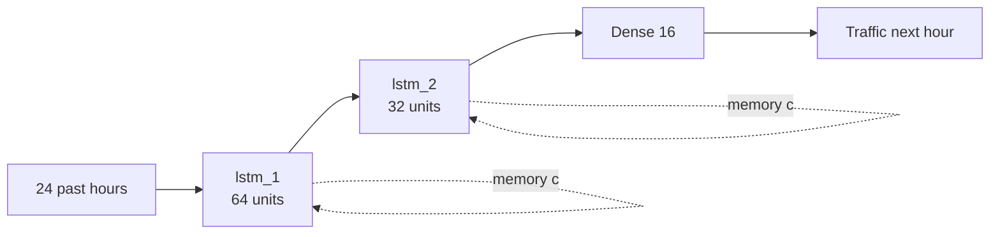

# Traffic LSTM - Start Here

Predicting motorway traffic one hour ahead with a stacked LSTM, and then
opening the network up to see *how* it got there.

> **Headline:** the model is wrong by **229 vehicles per hour** on
> average, against **594** for the best naive baseline
> (+60.9%). Hourly traffic on this road ranges from ~0 to
> ~7,280 vehicles.

## Walk through it in this order

1. [[01 Problem]] - why forecasting traffic is worth doing
2. [[02 Dataset]] - what the data actually contains
3. [[03 Pipeline]] - raw CSV to supervised sequences, without leaking
4. [[04 Architecture]] - the network, layer by layer
5. **[[Network Architecture.canvas|Canvas: the model]]**
6. **[[Neurons - Rush Hour.canvas|Canvas: every neuron at rush hour]]**
7. **[[Neurons - Quiet Night.canvas|Canvas: the same neurons at night]]**
8. **[[t00.canvas|Canvas: hour-by-hour timeline]]** - 24 canvases, the memory forming
9. [[05 Results]] - metrics, baselines, figures
10. [[06 Limits and Next Steps]]
11. [[07 Presentation Script]] and [[08 Exam Questions]]

## The mechanism in one picture

## Inside the layers

- [[lstm_1]] - 64 units, one hidden state per hour
- [[lstm_2]] - 32 units, one summary vector for the whole day
- [[dense_hidden]] and [[traffic_output]]

## The four gates

[[Forget gate]] - [[Input gate]] - [[Candidate memory]] - [[Output gate]] - [[Cell state]]

---
*Generated from `baseline_univariate` on 2026-09-12 12:28. Rebuild with*
`python -m traffic_lstm.train --export-vault`
