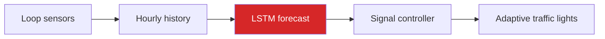

# 01 Problem

Traffic on a motorway is not random. It follows a strong daily cycle - a
morning peak, a midday plateau, an evening peak, an overnight trough - and
that cycle is modulated by the day of the week, the weather and holidays.

**The question this project answers:**

> Given the last 24 hours of traffic volume, how many vehicles will pass
> during the next hour?

## Why it matters

A traffic controller that only *reacts* to congestion is always one step
behind. A controller that knows the next hour in advance can act before the
queue forms.

**Be precise about the claim.** This model does *not* control traffic lights.
It produces a forecast that a control system could consume. Saying anything
stronger would be overselling it.

## Type of problem

| Question | Answer |
| --- | --- |
| Learning type | Supervised - each window has a known future value |
| Task | Regression - the output is a count of vehicles |
| Data shape | Univariate time series, hourly |
| Metric | MAE, in vehicles per hour |

Next: [[02 Dataset]]
