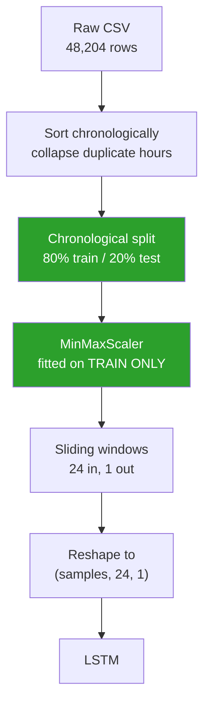

# 03 Pipeline



## The three rules that matter

### 1. The split is chronological, never shuffled

```python
train_size = int(len(values) * 0.8)
train, test = values[:train_size], values[train_size:]
```

`train_test_split(shuffle=True)` would put future hours in the training set
and past hours in the test set. The score would look excellent and mean
nothing, because in production you only ever have the past.

### 2. The scaler is fitted on the training slice only

```python
train_scaled = scaler.fit_transform(train)   # fit + transform
test_scaled  = scaler.transform(test)        # transform only
```

If the scaler saw the test set, the model would indirectly know the maximum
traffic volume of the future. That is **data leakage**.

### 3. The test set keeps its history

The first test window needs 24 hours of history, and those hours live at
the end of the training set. We prepend them - that is history, not leakage,
because the model only ever looks backwards.

## Building the windows

```python
for i in range(sequence_length, len(data) - max_horizon + 1):
    X.append(data[i - sequence_length:i, 0])   # the last 24 hours
    y.append(data[i + horizon - 1, 0])         # the hour we want
```

| | |
| --- | --- |
| Training sequences | 32,436 |
| Test sequences | 8,115 |
| Input shape | `(24, 1)` = 24 timesteps, 1 feature |

**Why 24 hours?** One full daily cycle. The network sees a complete
morning peak, evening peak and overnight trough before it has to predict.
A shorter window would cut the cycle in half; a much longer one adds
parameters without adding information.

Next: [[04 Architecture]]
