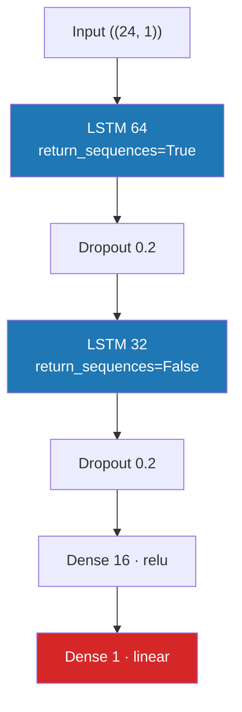

# 04 Architecture



Open **[[Network Architecture.canvas]]** for the same thing as a canvas.

## Layer by layer

- [[lstm_1]] - 64 units, returns a hidden state for **every one of the
  24 hours**, so the next layer still sees a sequence.
- **Dropout 0.2** - during training, 20% of the outputs are zeroed at
  random. The network cannot lean on any single unit, which reduces
  overfitting. At prediction time dropout is off.
- [[lstm_2]] - 32 units, returns **only the final state**: one vector that
  summarises the whole day.
- [[dense_hidden]] - 16 units with `relu`, recombining the summary.
- [[traffic_output]] - 1 linear unit(s). **No activation**, because the
  answer is a number of vehicles, not a probability.

## What one LSTM unit computes

At every hour `t`, each unit runs these five lines:

```
z = x_t . W + h_{t-1} . U + b

i = sigmoid(z_i)     input gate    - how much new information to write
f = sigmoid(z_f)     forget gate   - how much of the memory to keep
g = tanh(z_g)        candidate     - what the new information is
o = sigmoid(z_o)     output gate   - how much memory to expose

c_t = f * c_{t-1} + i * g   long-term memory
h_t = o * tanh(c_t)          what the next layer sees
```

That is the whole mechanism: [[Forget gate]] decides what survives,
[[Input gate]] decides what gets written, [[Candidate memory]] is the content,
[[Output gate]] decides what leaks out, and [[Cell state]] is the memory itself.

## This is not a diagram from a textbook

Every activation in this vault was recomputed from the trained weights with
the NumPy re-implementation in `introspect.py`, then checked against Keras:

> **Maximum absolute difference: `1.17e-07`**

Same network, same numbers. If they disagreed, the vault would be fiction.

## Parameter count

```
Model: "baseline_univariate"
+--------------------------------------------------------------------------+
| Layer (type)                    | Output Shape           |       Param # |
|---------------------------------+------------------------+---------------|
| lstm_1 (LSTM)                   | (None, 24, 64)         |        16,896 |
|---------------------------------+------------------------+---------------|
| dropout_1 (Dropout)             | (None, 24, 64)         |             0 |
|---------------------------------+------------------------+---------------|
| lstm_2 (LSTM)                   | (None, 32)             |        12,416 |
|---------------------------------+------------------------+---------------|
| dropout_2 (Dropout)             | (None, 32)             |             0 |
|---------------------------------+------------------------+---------------|
| dense_hidden (Dense)            | (None, 16)             |           528 |
|---------------------------------+------------------------+---------------|
| traffic_output (Dense)          | (None, 1)              |            17 |
+--------------------------------------------------------------------------+
 Total params: 89,573 (349.90 KB)
 Trainable params: 29,857 (116.63 KB)
 Non-trainable params: 0 (0.00 B)
 Optimizer params: 59,716 (233.27 KB)

```

Next: [[05 Results]]
