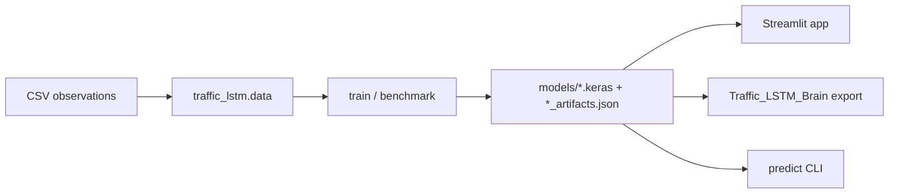

# Architecture

## Current shape (verified on main)

Single Python package under `src/traffic_lstm/`, Streamlit UI in `app/`, scripts for reports/experiments. No durable job worker, no relational metadata store, no authenticated API.

## Candidate target (planned — not implemented)

Incremental vertical slice, not a rewrite:

1. Keep ML package as the core library.
2. Add a small Python service + bounded job worker.
3. Persist workspace/dataset/job/model/forecast metadata relationally.
4. Versioned artifact storage with atomic publish.
5. Authenticated operational UI; retain Streamlit for research/education until a dedicated frontend is justified.

## Decision log

See `Decisions/`. First decisions pending recovery of pipeline v2 evidence.
